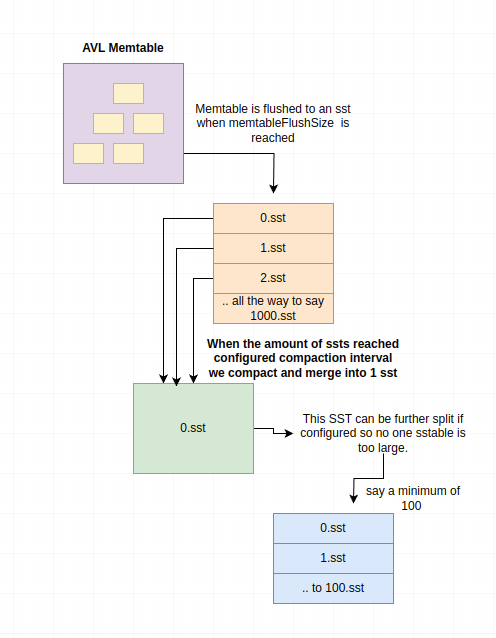

## LSMT package
The lsmt package provides a single level embedded log structured merge tree (LSMT) written completely in GO for efficient data storage and retrieval.

It features a memory-based AVL tree (memtable) that temporarily holds key-value pairs before flushing them to sorted string tables (SSTables) on disk.

Compaction is triggered when the number of SSTables reaches a certain threshold, and the SSTables are merged to reduce the number of files and improve read performance.

## Benchmarking
11th Gen Intel(R) Core(TM) i7-11700K @ 3.60GHz UBuntu with WDC WDS500G2B0A-00SM50(HDD) we put 1 MILLION keys in `523ms` 523 milliseconds

That is roughly *1,912,577 operations per second.*

<div>
    <h1 align="center"></h1>
</div>

### Usage
```go
// Create a new LSM-tree in the specified directory
directory := "data"

// You can specify the directory, file permissions, max memtable size (amount of keyv's), and compaction interval (amount of ssTables before compaction), amount of minimum sstables after compaction
lst, err := lmst.New(directory, os.ModePerm(0777), 10, 5, 2)
if err != nil {
    fmt.Println("Error creating LSM-tree:", err)
    return
}

defer os.RemoveAll(directory) // Clean up after use

// Successfully created the LSM-tree
fmt.Println("LSM-tree created successfully!")
```

### Put
You can insert a value into a key using the ``Put`` method.
If you try to insert a key that already exists, the value will be updated.
```go
// Assume lst is already created
// Insert key-value pairs into the LSM-tree
if err := lst.Put([]byte("key1"), []byte("value1")); err != nil {
    fmt.Println("Error inserting key1:", err)
}
if err := lst.Put([]byte("key2"), []byte("value2")); err != nil {
    fmt.Println("Error inserting key2:", err)
}

fmt.Println("Key-value pairs inserted successfully!")
```

### Get
To get a value you can you the ``Get`` method.  The get method will return all the keys values.
```go
// Assume lst is already created and populated
value, err := lst.Get([]byte("key1"))
if err != nil {
    fmt.Println("Error retrieving key1:", err)
} else {
    fmt.Println("Retrieved value for key1:", string(value))
}
```

### NGet
To get all keys not equal to the key you can use the ``NGet`` method.
```go
// Assume lst is already created and populated
keys, values, err:= lst.NGet([]byte("key1"))
if err != nil {
    fmt.Println("Error retrieving key1:", err)
} else {
    fmt.Println("Retrieved values not equal to key1:", string(value))
}
```

### Delete
Delete key2
```go
// Assume lst is already created
if err := lst.Delete([]byte("key2")); err != nil {
    fmt.Println("Error deleting key2:", err)
} else {
    fmt.Println("key2 marked for deletion.")
}
```

### Range
Get all keys between key56 and key100
```go
// Assume lst is already created and populated
keys, values, err := l.Range([]byte("key56"), []byte("key100"))
if err != nil {
    log.Fatal(err)
}
for i, key := range keys {
    fmt.Printf("Key: %s, Value: %s\n", string(key), string(values[i]))
}
```

### NRange
Get all keys not between key1 and key3
```go
// Assume lst is already created and populated
keys, values, err := l.NRange([]byte("key1"), []byte("key3"))
if err != nil {
    log.Fatal(err)
}
for i, key := range keys {
    fmt.Printf("Key: %s, Value: %s\n", string(key), string(values[i]))
}
```

### GreaterThan
Get all keys greater than key1
```go
// Assume lst is already created and populated
keys, values, err := lst.GreaterThan([]byte("key1"))
if err != nil {
    fmt.Println("Error retrieving key1:", err)
} else {
    fmt.Println("Retrieved value for key1:", string(value))
}
```

### GreaterThanEqual
Get all keys greater than or equal to key1
```go
// Assume lst is already created and populated
keys, values, err := lst.GreaterThanEqual([]byte("key1"))
if err != nil {
    fmt.Println("Error retrieving key1:", err)
} else {
    fmt.Println("Retrieved value for key1:", string(value))
}
```

### LessThan
Get all keys less than key1
```go
// Assume lst is already created and populated
keys, values, err := lst.LessThan([]byte("key1"))
if err != nil {
    fmt.Println("Error retrieving key1:", err)
} else {
    fmt.Println("Retrieved value for key1:", string(value))
}
```

### LessThanEqual
Get all keys less than or equal to key1
```go
// Assume lst is already created and populated
keys, values, err := lst.LessThanEqual([]byte("key1"))
if err != nil {
    fmt.Println("Error retrieving key1:", err)
} else {
    fmt.Println("Retrieved value for key1:", string(value))
}
```

### Compaction
```go
// Assume lst is already created and populated
if err := lst.Compact(); err != nil {
    fmt.Println("Error compacting LSM-tree:", err)
} else {
    fmt.Println("LSM-tree compacted successfully!")
}
```

### Close
Flushes the memtable to disk and closes all opened sstables
```go
// Assume lst is already created and populated
if err := lst.Close(); err != nil {
    fmt.Println("Error closing LSM-tree:", err)
} else {
    fmt.Println("LSM-tree closed successfully!")
}
```